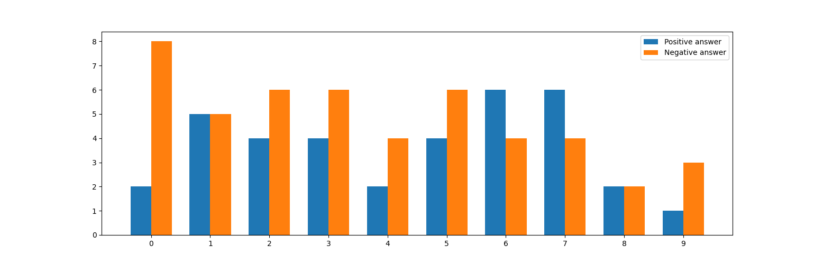
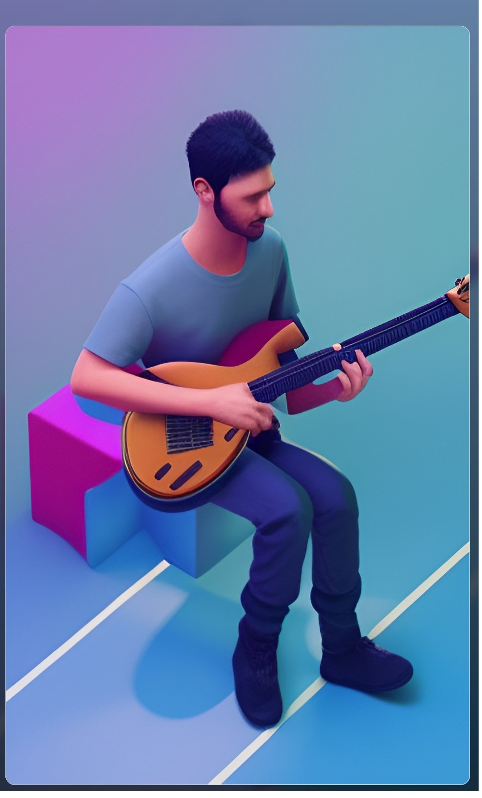

# Портрет целевой аудитории

## Опрос

- Вы профессиональный музыкант?
- У вас есть муз. образование?
- Вы играете в коллективе ? 
- Вы предпочитаете аккустику или электронику?
- Аккустика или Классика?
- Вы в среднем играете больше 8 часов в неделю?
- Вам нравится мерч?
- Играете ли вы на нескольких инструментах?
- Бас или Электро?
- Вам нравятся педали?

## Анализ

1. Нужно отметить, что 80% опрошенных не являются профессиональными музыканатми. Это в целом, более чем логично. Любителей намного пбольше, чем профессионалов, но они менее стабильная потребительская группа. 
2. 60% опрошенных играют в коллективах, значит было бы недурно продавать инструменты и аксесуары не только для гитар, но и для того, что с ними звучит, чтобы привлечь друзей. 
3. 60% опрошенных нравится мерч. В большинстве они непрофессиональные музыканты и играют нечасто. Стоит подумать о внедрении подобной атрибутики в ассортимент. 
4. 40%  опрошенных предпочитают аккустические гитары классическим или вообще электронику. Следственно закупать в больших объёмах нейлоновые струны не стоит, а вот металлические можно подвезти в ассортименте. 

Таким образом, средний посетитель нашего магазина это:
- любитель поиграть на аккустике дождливым осенним вечером
- энергичный парень/девушка, вершащий очередную творческую революцию с друзьями в гараже на перегрузе под пиво 

И выглядит он примерно так..

